# DevOps Engineer Interview Prep: FinancialServices

## How to Use This Guide

FinancialServices builds investing infrastructure for high-net-worth Indian investors managing ₹17,000+ crores in assets. Every technical decision in this guide is filtered through two lenses that show up repeatedly in the JD:

1. **Zero-downtime correctness**: a rebalancing job or trade execution cannot fail silently.
2. **SEBI-grade auditability**: every action must be traceable, immutable, and provable after the fact.

Study each section in order. Each section ends with **Likely Interview Questions** and, where relevant, **Architecture Comparison Tables** since the JD explicitly rewards candidates who can reason about tradeoffs, not just recite tool names.

---

## Table of Contents

1. Kubernetes and EKS: Cluster Ownership
2. AWS Architecture: EKS, ECR, Step Functions, Lambda, S3, CloudFront
3. Terraform: Writing Modules, Not Just Applying Them
4. CI/CD, GitOps, and Zero-Downtime Deployment Strategies
5. Observability: The LGTM Stack
6. Scripting and Internal Tooling (Python/Shell)
7. Networking in Cloud Environments
8. Security, Compliance, and Disaster Recovery
9. Communicating Tradeoffs to Non-Technical Stakeholders
10. Nice-to-Have Topics
11. Mock System Design Question (Full Walkthrough)
12. Final Interview Checklist

---

## 1. Kubernetes and EKS: Cluster Ownership

The JD says "own our Kubernetes clusters end to end" and gates on "at least half your career hands-on with Kubernetes." This means the interview will not stop at "can you write a Deployment YAML." It will test whether you can **operate** a cluster, not just deploy to one.

### 1.1 What "Ownership" Means in Practice

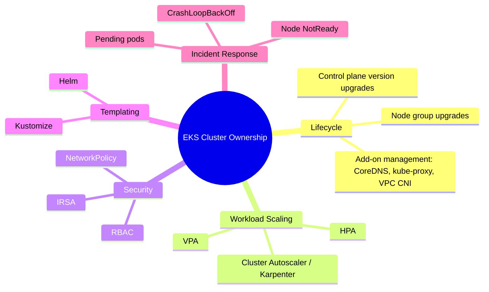

### 1.2 Scaling: HPA, VPA, Cluster Autoscaler, Karpenter

| Tool | What it scales | Key mechanism | Watch out for |
|---|---|---|---|
| **HPA** | Number of pod replicas | Metric-based (CPU/memory/custom) with stabilization windows | Cannot fix an undersized pod, only multiplies it |
| **VPA** | Resource requests/limits per pod | Evicts and recreates pod with new sizing | Conflicts with HPA if both target the same metric |
| **Cluster Autoscaler** | Number of nodes | Reactive, waits for a `Pending` pod (2-5 min latency) | Node-group based, can waste capacity |
| **Karpenter** | Number and shape of nodes | Proactive, bin-packs all pending pods at once | Limited cloud provider support outside AWS |

**Key asymmetry to explain in an interview:** HPA's default `scaleUp` window is `0s` while `scaleDown` defaults to `300s`. Under-provisioning hurts users immediately; over-provisioning costs money for a few extra minutes. For a rebalancing job pipeline, this asymmetry matters even more, a scale-down that's too aggressive could starve a job mid-execution.

### 1.3 RBAC and IRSA

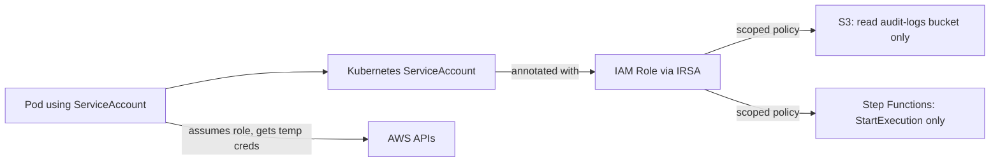

- **Roles/ClusterRoles**: Roles are namespace-scoped, ClusterRoles are cluster-wide. Use Roles for namespace-specific permissions (e.g., a team can only manage Deployments in their own namespace).
- **IRSA (IAM Roles for Service Accounts)**: lets a pod assume a scoped AWS IAM role via its Kubernetes ServiceAccount, instead of the entire node sharing one broad IAM role. This is the single most important security control to mention in this interview, it directly answers "how do you keep security tight, not an afterthought."

**Interview trap to avoid:** never say "we give the node IAM role broad permissions and let all pods use it." That is the wrong answer for a financial platform and interviewers will probe exactly this.

### 1.4 Helm vs Kustomize

| Dimension | Helm | Kustomize |
|---|---|---|
| Templating model | Go templates + values files | Patch-based overlays, no templating language |
| Packaging | Charts (versioned, shareable) | No packaging concept, just YAML + overlays |
| Learning curve | Steeper (templating syntax) | Gentler (plain YAML) |
| Best fit | Reusable, third-party or shared internal charts | Environment-specific overlays on top of a shared base |
| Native kubectl support | No (needs helm binary) | Yes (`kubectl apply -k`) |

**Recommended answer framing:** "For FinancialServices, I'd use Kustomize for environment overlays (dev/staging/prod differences on top of a common base) and Helm for anything we install from a third party (like an ingress controller or cert-manager), since those ship as Helm charts already."

### 1.5 Cluster Upgrade Sequencing

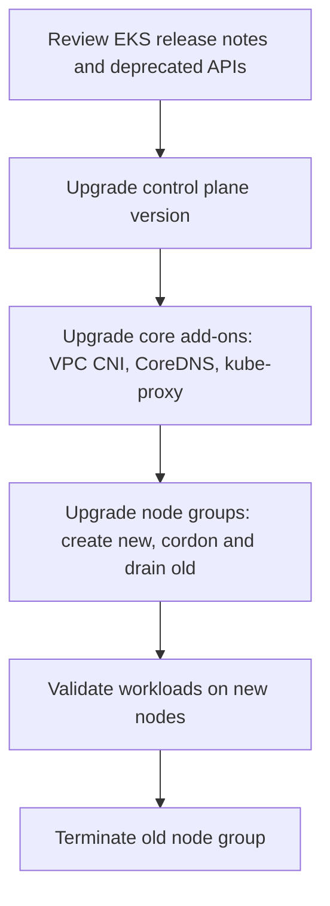

**Why order matters:** control plane must be upgraded before nodes (nodes can run one minor version behind, never ahead). Skipping add-on upgrades is a common real-world outage cause, since an old VPC CNI version can silently break pod networking on new node kernels.

### Likely Interview Questions: Section 1

- Walk me through how you'd upgrade an EKS cluster from version X to X+1 with zero downtime.
- A pod is stuck in `Pending`. Walk me through your diagnostic steps.
- Why would you choose IRSA over giving the EC2 node role broad S3 access?
- Your HPA and VPA are fighting each other. How do you fix it?
- When would you choose Kustomize over Helm, or vice versa?

---

## 2. AWS Architecture: EKS, ECR, Step Functions, Lambda, S3, CloudFront

This is the JD's own worked example: a rebalancing job that "can't fail silently." Understand this architecture as one connected system, not five separate services.

### 2.1 The Rebalancing Job: Reference Architecture

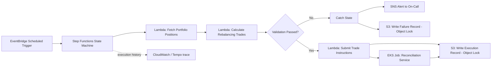

**Why Step Functions instead of a cron job running inside EKS?** This is a near-certain interview question. Answer with this comparison:

| Dimension | Cron Job on EKS | Step Functions State Machine |
|---|---|---|
| Audit trail | Must build yourself (custom logging) | Built-in, per-step execution history, visually inspectable |
| Retry/error handling | Manual (shell script logic) | Native `Retry`/`Catch` states, declarative |
| Failure visibility | Requires log aggregation to notice silently failed steps | Each state's success/failure is explicit and queryable |
| Cost model | Pays for idle EKS capacity even between runs | Pays only per state transition/Lambda invocation |
| Coupling | Tied to cluster health/availability | Decoupled from cluster state entirely |
| Best fit here | Long-running, always-on services (reconciliation, APIs) | Discrete, auditable, multi-step financial workflows |

**The one-sentence answer that lands well in an interview:** "For a rebalancing job, I want an audit trail as a byproduct of the architecture, not something I bolt on afterward. Step Functions gives me that natively, cron on EKS does not."

### 2.2 Lambda: Idempotency Is Non-Negotiable Here

A retried Lambda invocation (due to a timeout or transient failure) must never double-execute a trade. Teach:
- **Idempotency keys**: every trade instruction carries a unique key; the execution Lambda checks a DynamoDB or S3 record before acting, so a retry recognizes "already done" and skips re-execution.
- **Timeout and memory tuning**: Lambda has a hard 15-minute execution cap, long-running calculation steps may need to be broken into smaller Step Functions states rather than one large Lambda.
- **Cold starts**: acceptable for a scheduled batch job (latency doesn't matter), unacceptable if Lambda were used for a synchronous, user-facing request, know the difference and state it explicitly in an interview.

### 2.3 ECR: Image Integrity for a Regulated Platform

- **Image scanning** (ECR native scanning or a third-party tool) on every push, block deploys on critical CVEs.
- **Immutable tags**: tag images by commit SHA, never rely on `:latest`, this is required for a clean audit trail (you must be able to say exactly which image was running at a given timestamp).
- **Lifecycle policies**: expire untagged/old images to control storage cost without breaking rollback capability for recent releases.

### 2.4 S3: Object Lock for Immutable Audit Trails

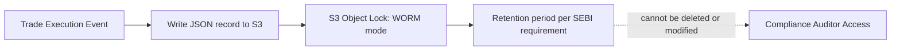

**S3 Object Lock (Write Once, Read Many)** is the direct technical answer to "SEBI-grade audit trails baked into the pipeline." Once written, a record cannot be modified or deleted until the retention period expires, even by an account administrator (in compliance mode). This is worth naming specifically in an interview, it shows you know the actual mechanism, not just "we log things to S3."

### 2.5 CloudFront

- Fronts the investor-facing web/app layer for global edge caching and TLS termination.
- **Origin failover**: configure a secondary origin so a regional issue doesn't take down the investor portal.
- **Cache invalidation strategy**: must be tied into the CI/CD pipeline, a deploy isn't "done" until stale cached assets are invalidated, relevant to the zero-downtime deploy theme.

### 2.6 Architecture Comparison: EKS vs Lambda, When to Use Which

| Workload Type | Choose EKS | Choose Lambda/Step Functions |
|---|---|---|
| Long-running API service | Yes | No (15-min cap, not designed for this) |
| Scheduled, auditable financial workflow | Possible, but audit trail must be built manually | Yes, native execution history |
| Bursty, event-driven, infrequent | Overkill (idle capacity cost) | Yes, pay-per-invocation |
| Requires fine-grained autoscaling of many microservices | Yes (HPA/VPA/Karpenter) | Not applicable at this granularity |
| Requires strict step-by-step audit trail | Possible via custom tooling | Yes, natively |

### Likely Interview Questions: Section 2

- Why would you choose Step Functions over a Kubernetes CronJob for a financial batch process?
- How do you guarantee a Lambda retry doesn't double-execute a trade?
- What AWS feature would you use to make an audit log tamper-proof, and how does it actually work?
- Walk me through what happens end-to-end when a rebalancing job fails validation.

---

## 3. Terraform: Writing Modules, Not Just Applying Them

The JD repeats this requirement twice, expect a hands-on module-writing exercise, not a conceptual Q&A only.

### 3.1 Module Structure

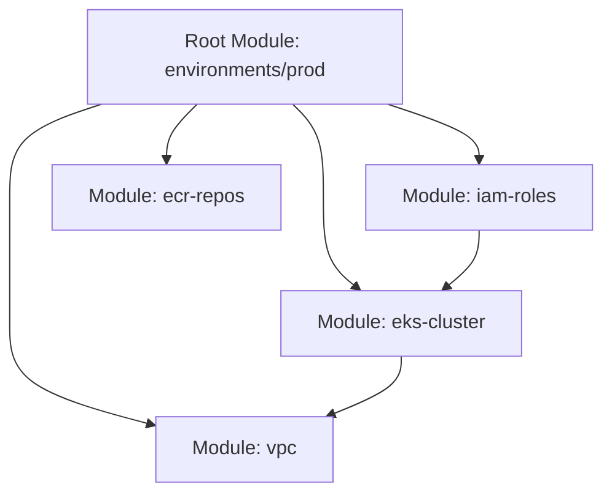

- **Root module** (per environment: dev/staging/prod) calls **child modules** with environment-specific variables.
- Child modules expose clear **inputs** (variables with validation blocks) and **outputs** (so other modules can consume them, e.g., the VPC module outputs subnet IDs that the EKS module consumes).
- Avoid hardcoding values inside modules, everything environment-specific comes from the caller.

### 3.2 State Management

- **Remote state**: S3 backend with **DynamoDB for state locking**, prevents two engineers from applying concurrently and corrupting state.
- **State isolation per environment**: separate state files (or workspaces) for dev/staging/prod so a mistake in one environment can't touch another, critical for a financial platform.

### 3.3 Safety Practices to Mention

- `terraform plan` review as a mandatory PR gate, no direct `apply` without review.
- Static analysis tools: `tflint` for style/correctness, `checkov` or `tfsec` for security misconfigurations (e.g., an S3 bucket accidentally left public), this directly supports "security not an afterthought."
- Drift detection: periodic `terraform plan` runs in CI to catch manual console changes before they cause an incident.

### Likely Interview Questions: Section 3

- Write (or describe) a reusable Terraform module for an EKS managed node group. What inputs and outputs would it expose?
- How do you prevent two engineers from corrupting Terraform state by applying at the same time?
- How would you catch a security misconfiguration (like a public S3 bucket) before it reaches production?
- How do you structure Terraform across dev, staging, and prod without duplicating code?

---

## 4. CI/CD, GitOps, and Zero-Downtime Deployment Strategies

This section directly answers "a rebalancing job can't fail silently" from the JD's opening paragraph.

### 4.1 Pipeline Overview

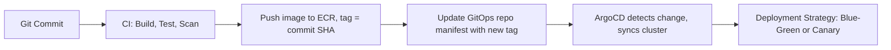

### 4.2 Why GitOps Fits a Regulated Platform

In a GitOps model (ArgoCD/Flux), the cluster's desired state lives declaratively in Git, and a controller continuously reconciles actual state to match it. Every deployment is a Git commit. This means:
- **The audit trail is a side effect of the workflow itself**: `git log` shows exactly who changed what, when, and why (via commit message/PR).
- **Rollback is a Git revert**, not a manual `kubectl` command run under pressure during an incident.

This is a strong, specific answer to give when asked "how do you keep deployments auditable."

### 4.3 Deployment Strategy Comparison

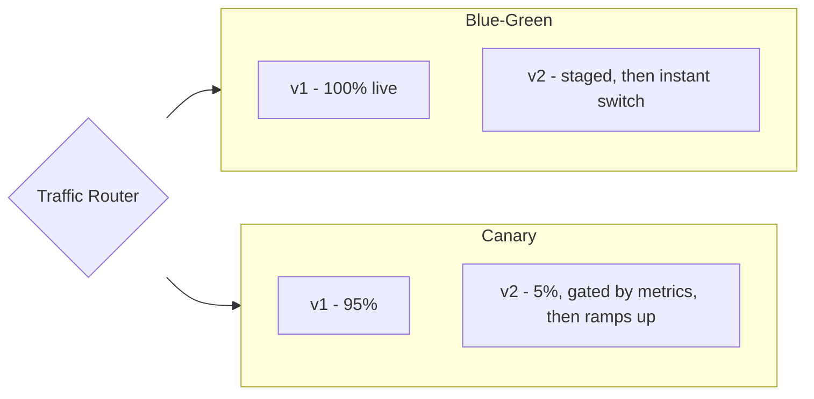

| Strategy | Rollback Speed | Blast Radius | Best Fit for FinancialServices |
|---|---|---|---|
| Rolling Update | Minutes | Grows progressively | Internal tooling, low-risk services |
| **Blue-Green** | Instant | All-or-nothing | **Rebalancing job execution service, trade pipeline** |
| **Canary** | Fast | Small, controlled | **Investor-facing web/API layer** |
| Feature Flags | Instant, no redeploy | Fully controllable | Gradual rollout of new investor-facing features |

**Why blue-green for the rebalancing pipeline specifically:** a canary at even 5% traffic means two code versions could be executing trade logic concurrently against shared state. Blue-green's all-or-nothing cutover guarantees only one version is ever live, avoiding any chance of inconsistent logic touching the same portfolio data simultaneously. This is the exact reasoning interviewers are listening for when they mention "a rebalancing job can't fail silently."

**Why canary for the investor-facing layer:** a large user base benefits from gradual exposure with metric gating (error rate, latency) before a bad release reaches everyone.

### Likely Interview Questions: Section 4

- Design a zero-downtime deployment pipeline for a financial batch job with audit requirements. (Expect this almost verbatim, it mirrors the JD's own framing.)
- Why is blue-green preferred over canary for the rebalancing job, even though canary has a smaller blast radius?
- How does GitOps improve auditability compared to a traditional push-based CI/CD pipeline?
- What happens, step by step, when you need to roll back a bad blue-green deploy?

---

## 5. Observability: The LGTM Stack

Named explicitly in the JD with unusual specificity. Most candidates will only know Prometheus/CloudWatch, fluency here is a genuine differentiator.

### 5.1 How the Four Components Fit Together

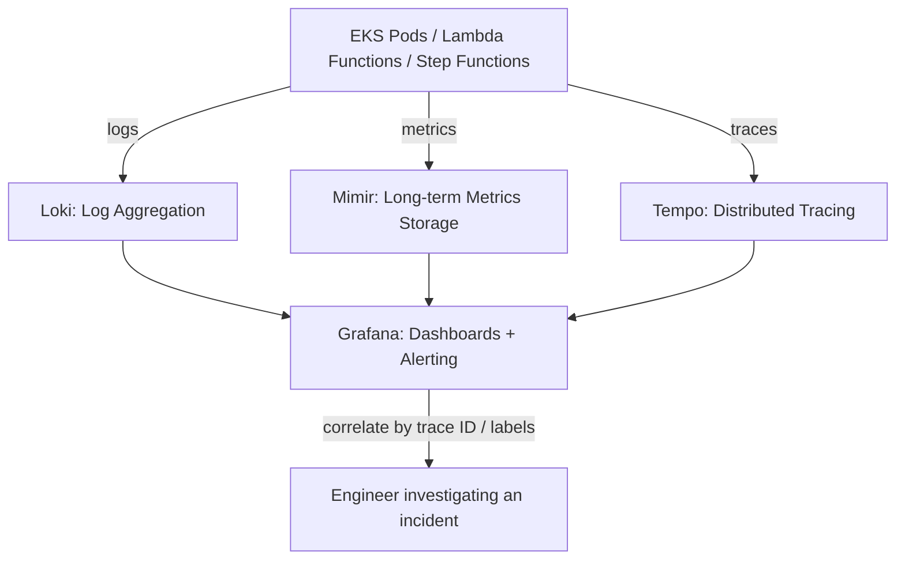

| Component | Role | Analogy | Query Language |
|---|---|---|---|
| **Loki** | Log aggregation, indexes only labels (not full text), cheap and fast | "Prometheus, but for logs" | LogQL |
| **Grafana** | Unified visualization and alerting layer across all three data sources | The dashboard/cockpit | N/A (UI layer) |
| **Tempo** | Distributed tracing, follows a single request across services | The GPS trail of one request | TraceQL |
| **Mimir** | Horizontally scalable, long-term storage for Prometheus-style metrics | "Prometheus that doesn't run out of disk or fall over at scale" | PromQL-compatible |

### 5.2 Why LGTM Over CloudWatch-Only or Prometheus-Only

| Dimension | CloudWatch Only | Prometheus Only (self-hosted) | LGTM Stack |
|---|---|---|---|
| Long-term metric retention at scale | Expensive at high cardinality | Prometheus alone struggles past single-node scale | Mimir designed for horizontal scale |
| Log query flexibility | CloudWatch Insights, proprietary syntax | N/A (not a logging tool) | LogQL, label-based, cheap indexing |
| Distributed tracing | X-Ray (separate tool, separate UI) | N/A (not a tracing tool) | Tempo, unified in Grafana |
| Multi-cloud portability | AWS-locked | Portable | Portable |
| Unified single-pane view | No (separate consoles per signal) | No (metrics only) | Yes, Grafana correlates all three |

**Interview-ready answer:** "LGTM gives us one correlated view across logs, metrics, and traces instead of jumping between CloudWatch, X-Ray, and a separate metrics tool. For an incident on the rebalancing pipeline, I can start from a failed Step Functions execution, pull the trace in Tempo to see which Lambda call was slow, and jump straight to that Lambda's logs in Loki, all inside Grafana."

### 5.3 Tracing Across a Hybrid EKS + Lambda + Step Functions Architecture

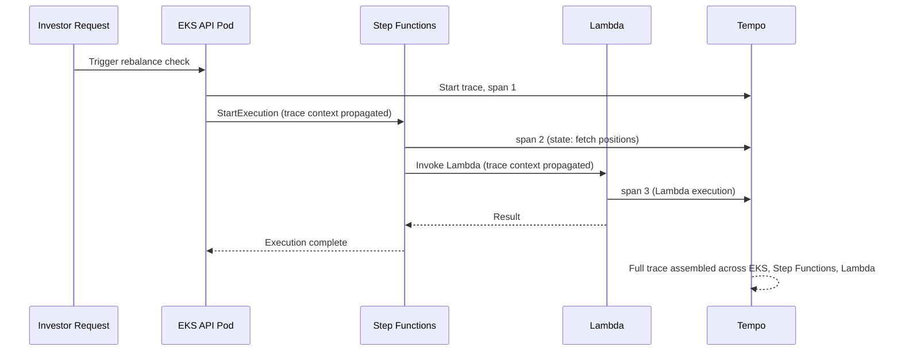

**Key teaching point:** trace context propagation across a hybrid architecture (EKS to Step Functions to Lambda) is non-trivial and worth mentioning explicitly, it requires passing trace headers/IDs through each service boundary, not something you get for free.

### Likely Interview Questions: Section 5

- Explain what each letter in LGTM stands for and how they work together.
- How is Loki different from a traditional full-text log search tool like Elasticsearch?
- Walk me through how you'd trace a slow rebalancing job across EKS, Step Functions, and Lambda.
- Why might Mimir be preferred over vanilla Prometheus at scale?

---

## 6. Scripting and Internal Tooling (Python/Shell)

The JD frames this as building automation that "gets manual ops work off everyone's plate," not generic scripting trivia.

### 6.1 What to Actually Practice

- **Python with boto3**: scripts that audit IAM policies for overly broad permissions, find and clean up unused ECR images past a retention window, or generate a compliance report by querying CloudTrail for a date range.
- **Shell scripts**: health-check wrappers, backup verification scripts (don't just take a backup, verify it can be restored), log rotation.
- **Idempotency in scripts**: a script that provisions or cleans up resources should be safe to re-run without side effects, directly relevant to the financial-correctness theme running through the whole JD.

### 6.2 A Strong Portfolio Example to Prepare

Build (or describe in detail) a Python script that:
1. Queries CloudTrail for all IAM policy changes in the last 24 hours.
2. Flags any change that grants `*` (wildcard) permissions.
3. Writes a report to S3 with Object Lock enabled.
4. Sends a Slack/SNS alert if a flagged change is found.

This single example touches security, compliance, automation, and AWS scripting all at once, exactly the kind of concrete, specific answer that stands out in a behavioral or technical round.

### Likely Interview Questions: Section 6

- Tell me about a script or tool you built that removed manual ops work.
- How do you make sure a cleanup script doesn't accidentally delete something in use?
- Write a script (pseudocode is fine) to find all ECR images not deployed in any running EKS pod.

---

## 7. Networking in Cloud Environments

Called out as its own distinct requirement in the JD, not folded into "AWS infrastructure."

### 7.1 Layered Defense Model

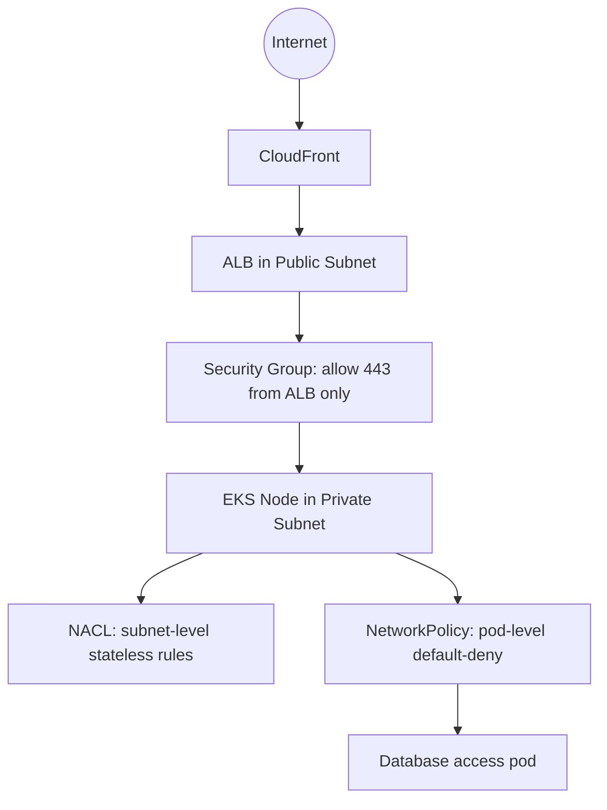

| Layer | Scope | Statefulness | Granularity |
|---|---|---|---|
| **NACL** | Subnet | Stateless (must allow both directions explicitly) | Coarse |
| **Security Group** | ENI/instance | Stateful | Medium |
| **Kubernetes NetworkPolicy** | Pod (via labels) | Enforced by CNI | Fine-grained, identity-based |

**Interview-ready synthesis:** "We use three layers of network defense: NACLs at the subnet boundary as a coarse backstop, security groups at the instance/ENI level for stateful rules, and Kubernetes NetworkPolicy inside the cluster for pod-to-pod identity-based rules. Even if a frontend pod is compromised, NetworkPolicy stops it from reaching the database pod directly, that's default-deny with selective allow, the same pattern repeated at every layer."

### 7.2 VPC Design for FinancialServices

- Public subnets: only the ALB/NAT gateway live here.
- Private subnets: EKS nodes, Lambda ENIs (if VPC-attached), RDS/data stores.
- NAT Gateway: allows private subnet resources outbound internet access without being directly reachable inbound.
- Route 53 + internal service discovery via CoreDNS for service-to-service naming inside the cluster.

### Likely Interview Questions: Section 7

- What's the difference between a Security Group and a NACL, and why do you need both?
- How does Kubernetes NetworkPolicy relate to security groups, are they redundant?
- Design the VPC subnet layout for an EKS cluster serving both public API traffic and internal batch jobs.

---

## 8. Security, Compliance, and Disaster Recovery

The connective tissue across the entire JD. Reuse this as a checklist mentality in every answer.

### 8.1 The Core Checklist

| Concern | Control |
|---|---|
| Audit trail immutability | S3 Object Lock (WORM), CloudTrail, Step Functions execution history |
| Least-privilege identity | IRSA, scoped IAM policies, no wildcard permissions |
| Secrets | AWS Secrets Manager / Parameter Store, never in Git or CI variables in plaintext |
| Network isolation | NACL + Security Groups + NetworkPolicy (Section 7) |
| Encryption at rest | KMS-backed encryption on S3, RDS, EBS; customer-managed keys for the most sensitive data |
| Encryption in transit | TLS everywhere, mTLS for pod-to-pod if using a service mesh |
| Image integrity | ECR scanning, immutable tags |

### 8.2 RTO and RPO for a Financial Platform

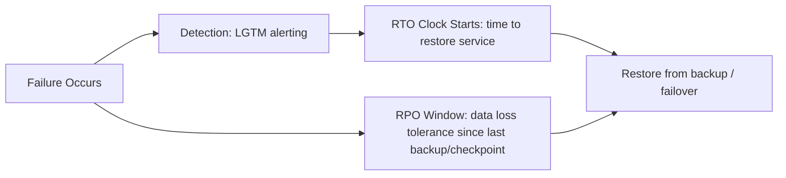

- **RTO (Recovery Time Objective)**: how long the rebalancing pipeline can be down before it's a critical incident. For a platform managing ₹17,000+ crores, this should be defined explicitly and tightly, not left vague.
- **RPO (Recovery Point Objective)**: how much data (or how many trade instructions) can be lost. For financial transactions, the target should approach zero, this is why idempotent, checkpointed Step Functions execution (Section 2) matters: a failure mid-execution can resume from the last completed state rather than losing the whole job.

### Likely Interview Questions: Section 8

- What's the difference between RTO and RPO, and what would you set them to for a trade execution pipeline?
- How do you make sure a secret never ends up in a Git commit or CI log?
- Walk me through your defense-in-depth strategy for a pod that handles sensitive investor data.

---

## 9. Communicating Tradeoffs to Non-Technical Stakeholders

Explicitly tested, likely in a behavioral round. Practice this actively, don't just read about it.

### 9.1 Practice Framework

For any technical decision, structure the explanation in three parts:
1. **The plain-language analogy** (no jargon).
2. **The tradeoff in business terms** (cost, risk, speed).
3. **The recommendation**, stated plainly.

**Worked example, blue-green deployment, explained to a compliance officer:**

> "Think of it like having two identical trading floors, one live, one on standby. We test the new floor completely before we ever send real activity to it, then we flip a switch and everyone moves over at once. If something's wrong, we flip back instantly. It costs us a bit more to keep both floors running during the switch, but it means we're never in a state where half the trades are running old logic and half are running new logic at the same time. For our rebalancing job, that consistency matters more than the extra cost."

### 9.2 Drill Exercise

Practice explaining each of these in under 60 seconds, no jargon:
- Why HPA alone can't fix a slow application.
- Why Terraform modules are safer than manual console changes.
- Why S3 Object Lock matters for a SEBI audit.
- Why canary deployments protect the investor-facing app.

### Likely Interview Questions: Section 9

- Explain to a non-technical product manager why a deployment took longer than expected because of a blue-green rollout.
- A compliance officer asks why we need "all this extra infrastructure" for audit logs. What do you say?

---

## 10. Nice-to-Have Topics

| Topic | What to prepare |
|---|---|
| AWS Certification | Not required for the interview itself, but studying for the AWS DevOps Engineer or Solutions Architect exam guide reinforces everything above |
| Prometheus/Nagios/Datadog | Be ready to compare briefly: "Prometheus and Mimir are compatible in query language, Mimir just solves the long-term storage/scale problem. Datadog is a paid SaaS alternative to the whole LGTM stack." |
| Database admin exposure | Know backup/restore basics, read replicas, and connection pooling for MySQL/Postgres at a practitioner level |
| Agentic AI tools in DevOps workflow | Be ready to describe a specific example: e.g., using an AI coding assistant to draft a Terraform module or debug a failing pipeline, and critically reviewing/correcting its output before merging. Vague answers ("I've used ChatGPT") are weak, specific workflow examples are strong |

---

## 11. Mock System Design Question (Full Walkthrough)

**Prompt likely to be asked:** *"Design a zero-downtime deployment pipeline for a financial rebalancing job with SEBI-grade audit requirements."*

### Suggested Answer Structure

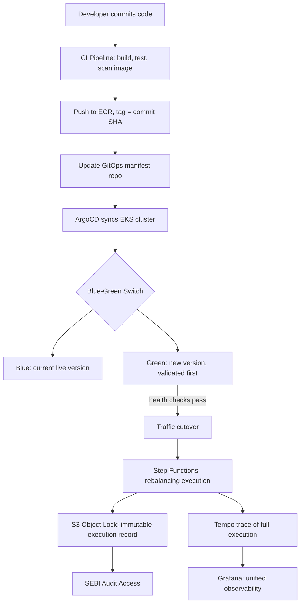

**Talking points to hit in order:**
1. Code change flows through CI (build, test, ECR image scan) before anything touches production.
2. GitOps means the deployment itself is a Git commit, auditable by design.
3. Blue-green (not canary) for the execution service itself, no partial-version coexistence during a financial job.
4. Step Functions orchestrates the actual rebalancing logic with native retry/catch and execution history.
5. Every execution writes an immutable record to S3 with Object Lock, satisfying the SEBI audit requirement independent of application-level logging.
6. LGTM stack ties logs, metrics, and traces together so any failure can be root-caused quickly without stitching together five different tools.
7. RTO/RPO targets are defined explicitly and tested via DR drills, not just assumed.

This structure demonstrates exactly what the JD is testing: end-to-end ownership, tradeoff reasoning, and a security/compliance mindset baked in rather than bolted on.

---

## 12. Final Interview Checklist

Before the interview, be able to answer each of these out loud, in under 90 seconds, without notes:

- [ ] Walk through an EKS cluster upgrade end to end.
- [ ] Explain IRSA and why it's safer than a shared node IAM role.
- [ ] Compare HPA, VPA, and Cluster Autoscaler/Karpenter, and when each is used.
- [ ] Explain why Step Functions fits a financial batch job better than a cron job on EKS.
- [ ] Describe how S3 Object Lock provides SEBI-grade auditability.
- [ ] Compare blue-green and canary deployments, and justify which fits a rebalancing job.
- [ ] Explain what each component of LGTM does and how they connect in Grafana.
- [ ] Describe a Terraform module you've written, including its inputs and outputs.
- [ ] Explain the three-layer network defense model (NACL, Security Group, NetworkPolicy).
- [ ] Define RTO and RPO and give concrete targets for a trade execution pipeline.
- [ ] Give one specific, real example of using an AI tool in your DevOps workflow.
- [ ] Explain any one of the above concepts in plain language, as if to a compliance officer.
