# Scaling in k8s

**Program:** DevOps  
**Work Type:** Post-read  
**Created by:** vilas  
**Date:** 2026-08-20

---

# Note 1: AWS Compute/Platform Deployment Options for IamDistributor

## 1. What "Production-Quality Deployment" Actually Means

Before comparing AWS services, anchor the class on the five dimensions every production deployment decision must be judged against. A platform choice that's excellent on one dimension can be a liability on another, this is why IamDistributor cannot use a single AWS service for its entire business.

| Dimension | Question it answers |
|---|---|
| **Availability** | Does the platform survive an AZ failure, instance crash, or traffic spike without user-visible downtime? |
| **Scalability** | Can capacity grow/shrink automatically and match the actual shape of demand (spiky vs steady vs batch)? |
| **Security & Compliance** | Can the workload be isolated (network, IAM, data) to the degree its risk profile demands? |
| **Rollback Safety** | If a bad deploy ships, how fast and how cleanly can you undo it? |
| **Cost Efficiency** | Are you paying for idle capacity, or paying proportional to actual usage? |
| **Operability** | How much day-2 operational burden (patching, scaling config, cluster upkeep) does the team absorb? |

**Teaching point:** EcoRetail is not one application, it's five distinct businesses running under one brand (marketplace, logistics, fintech, retail SaaS, data analytics). Each has a different answer to "which dimension matters most," so each deserves its own platform decision rather than a company-wide default.

---

## 2. IamDistributor's Workload Map

Walk through this table with students before touching any AWS service. The goal is to get them reasoning about workload *shape* first, tools second.

| Pillar | Traffic Pattern | State | Criticality / Compliance | Notes |
|---|---|---|---|---|
| **B2B Marketplace App** (retailer ordering) | Spiky, high-volume, daily order-cutoff peaks | Mostly stateless API, session/cart state external | High (revenue-generating, customer-facing) | 500,000+ retailers, needs elastic scaling |
| **Logistics & Fulfillment** (warehouses, dark stores, last-mile) | Steady + scheduled bursts (route planning, cutoff windows), background-job heavy | Mix of stateless services + long-running jobs (route optimization) | High (delivery SLAs) | Queue-driven, tolerant of slightly higher latency than customer-facing API |
| **Fintech / Credit Engine** (BNPL, working capital, Solv) | Lower volume, steady, transactional | Strongly consistent, ledger-style state | Very high (financial compliance, auditability, data isolation) | Needs strict network/data isolation, immutable audit trail |
| **J24 POS / Retail SaaS** | Distributed, intermittent connectivity from tier-2/3 stores | Local-first with periodic sync | Medium-high (store operations depend on it, but tolerant of async sync) | Thousands of independent, loosely-connected endpoints |
| **FMCG Data & Analytics** (Nestlé, Unilever, ITC dashboards) | Batch / near-real-time, large volume, not latency-critical | Stateless compute over stored data | Medium (business intelligence, not transactional) | Cost-sensitivity matters more than millisecond latency |

**Discussion prompt:** "Which of these five would you be most nervous deploying with a serverless cold-start? Which would you be most nervous deploying with a slow rollback?" This primes students to separate scaling concerns from safety concerns before we introduce the AWS options.

---

## 3. AWS Deployment Platform Options

### 3.1 EC2 + Auto Scaling Group (Self-Managed)

The most manual, most flexible option. You own the OS, patching, and scaling configuration.

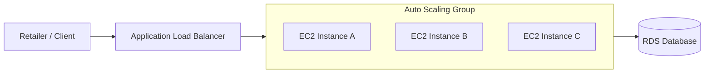

- **Pros:** Full control over the OS and runtime, no orchestration abstraction to learn, predictable for teams already fluent in Linux/VM ops.
- **Cons:** Highest operational burden (patching, AMI management, scaling policy tuning by hand), slowest to scale (minutes for new instance boot), no built-in service discovery or rolling-update primitives, you build all of that yourself.
- **When to use:** Legacy workloads not yet containerized, or highly specialized workloads needing custom kernel/OS tuning.

### 3.2 AWS Elastic Beanstalk

A PaaS wrapper around EC2 + ASG + ALB. You upload code/artifact, Beanstalk provisions and manages the underlying infrastructure.

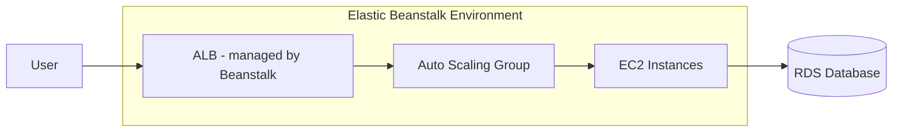

- **Pros:** Fast to stand up, less Terraform/manual VPC wiring needed for a first deployment, good for small teams or early-stage services.
- **Cons:** Less flexible than raw EC2 or containers, harder to customize deeply, not well suited to complex microservice topologies, and it becomes a dead end as the architecture grows.
- **When to use:** Rarely the final answer for a company at IamDistributor's scale; more relevant for prototypes or single-service internal tools.

### 3.3 ECS (Elastic Container Service): Fargate and EC2 Launch Types

Container orchestration, AWS-native, two launch types.

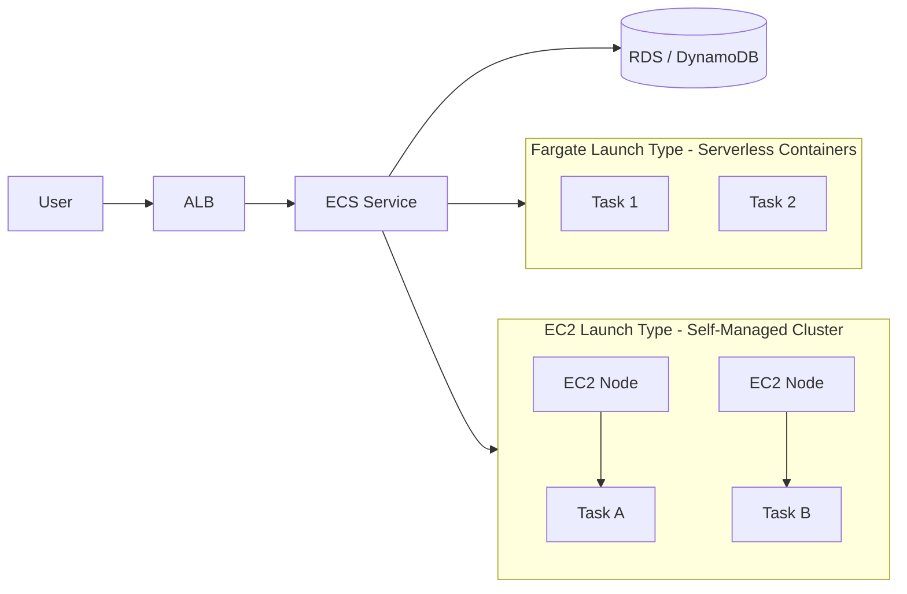

- **Fargate:** No servers to manage, AWS handles the host entirely, you pay per task's vCPU/memory-seconds.
- **EC2 launch type:** You manage the underlying EC2 cluster hosting the containers, more control, cheaper at sustained high scale, more ops overhead.
- **Pros:** Simpler mental model than Kubernetes, tight native integration with ALB, CloudWatch, IAM (task roles), CodeDeploy for blue-green.
- **Cons:** AWS-proprietary (less portable than Kubernetes), less flexible for complex multi-service networking patterns, ecosystem of tools smaller than Kubernetes' (fewer third-party operators/controllers).
- **When to use:** Teams wanting container benefits without Kubernetes' operational complexity; a very strong fit for services that don't need Kubernetes-specific features.

### 3.4 EKS (Elastic Kubernetes Service)

Full Kubernetes control plane managed by AWS, worker capacity via managed node groups, Karpenter, or Fargate profiles.

- **Pros:** Full portability (same manifests work on any cloud), the richest ecosystem (Helm, Argo Rollouts, service mesh, custom operators), fine-grained scaling (HPA/VPA) and bin-packing (Karpenter), strong story for microservices at scale, direct reuse of your existing scaling and NetworkPolicy training.
- **Cons:** Highest learning curve, most operational surface area (CNI choice, RBAC, upgrades, add-on management), overkill for a small number of simple services.
- **When to use:** Complex, high-growth microservice estates where team already has (or is building) Kubernetes expertise, and where multi-cloud portability or ecosystem breadth matters.

### 3.5 Lambda + API Gateway (Serverless)

Event-driven, no servers, pay per invocation and execution time.

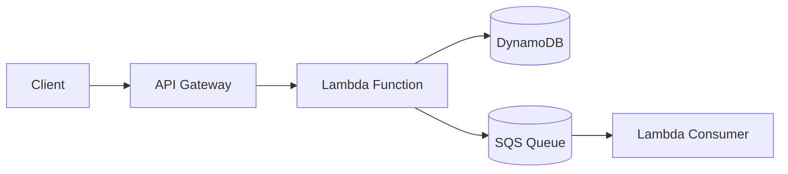

- **Pros:** Zero idle cost, scales instantly and automatically to near-infinite concurrency, no infrastructure to patch.
- **Cons:** Cold starts add latency (problematic for latency-sensitive customer-facing paths), 15-minute max execution time, harder to reason about long-running or highly stateful workflows, cost can exceed containers at sustained high throughput.
- **When to use:** Event-driven, bursty, or infrequent workloads: webhook processing, notification dispatch, image/file processing, glue logic between systems.

### 3.6 Managed Data/Batch Services (Glue, EMR, Step Functions, Kinesis)

Purpose-built for data pipelines rather than request/response APIs.

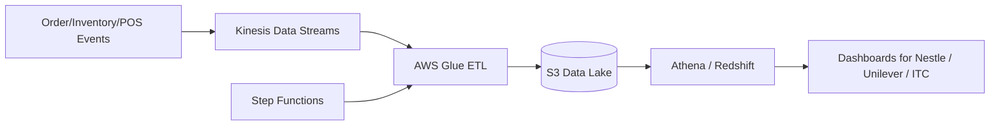

- **Pros:** Purpose-built for large-scale, scheduled or streaming data transformation, decoupled from live transactional systems (protects production databases from analytical query load).
- **Cons:** Not suited to synchronous request/response traffic, adds pipeline latency (near-real-time, not real-time), requires data engineering skill set distinct from application DevOps.
- **When to use:** Any workload whose output is a report, dashboard, or model, not a live user-facing response.

---

## 4. Comparison Matrix

| Platform | Ops Overhead | Scaling Granularity | Cold Start | Cost Model | Compliance/Isolation Fit | Team Skill Needed |
|---|---|---|---|---|---|---|
| EC2 + ASG | High | Coarse (whole instances, minutes) | None (always warm) | Pay for provisioned capacity | Good (full control) | Linux/VM ops |
| Elastic Beanstalk | Medium | Coarse | None | Pay for provisioned capacity | Moderate | Minimal AWS knowledge |
| ECS Fargate | Low | Fine (per task) | Low-moderate | Pay per task-second | Good (task-level IAM roles) | Container basics |
| ECS EC2 launch type | Medium | Fine (per task, shared hosts) | None | Pay for provisioned hosts | Good | Container + some ops |
| EKS | High | Very fine (HPA/VPA/Karpenter) | Low (warm pods) | Pay for nodes + control plane fee | Excellent (NetworkPolicy, RBAC, namespaces) | Kubernetes expertise |
| Lambda + API Gateway | Very low | Instant, per-invocation | Present (100ms-seconds) | Pay per invocation/duration | Good (IAM per function) | Event-driven design |
| Glue/EMR/Step Functions | Low-medium | Job-level | N/A (batch) | Pay per job/DPU-hour | Good (isolated from live systems) | Data engineering |

---

## 5. Mapped Recommendations per IamDistributor Pillar

### B2B Marketplace App → **EKS** (or ECS Fargate as a lighter alternative)
High, spiky, customer-facing traffic across 500,000+ retailers needs fine-grained autoscaling (HPA, Karpenter for bin-packing during festival-season order spikes) and a microservice topology (catalog, cart, order, pricing services). EKS gives the richest scaling and traffic-management tooling (Argo Rollouts for canary, Ingress-based routing) and the strongest ecosystem for a growing, complex service mesh. If the team is smaller and doesn't want Kubernetes overhead yet, ECS Fargate is the pragmatic fallback: still containerized, still auto-scaled, far less operational burden.

### Logistics & Fulfillment → **EKS**, with heavy use of **SQS/Step Functions** for job orchestration
Route optimization and warehouse/dark-store coordination are naturally decomposed into background jobs and services with varying resource needs (some CPU-heavy for route computation, some I/O-heavy for inventory sync). EKS's per-workload resource shaping (VPA) plus queue-driven worker pods scaled by HPA on queue depth fits this well. Long-running batch jobs (nightly route planning) can offload to Step Functions rather than living inside the cluster.

### Fintech / Credit Engine (BNPL, Solv) → **EKS (dedicated namespace/node group) or ECS Fargate, never a shared serverless pool**
This is the highest-compliance pillar. Recommendation: a **dedicated, isolated environment** (separate VPC subnet, separate node group, or separate AWS account entirely) with default-deny NetworkPolicies (direct reuse of your existing Module 2 content) restricting the credit engine to only the exact services it must talk to. Containers (ECS or EKS) are preferred over Lambda here not because Lambda is insecure, but because **auditability and predictable execution** (consistent logging, consistent IAM role per long-lived service, easier correlation of a transaction's full lifecycle) are simpler to reason about and demonstrate to auditors with long-running, identity-stable containers than with ephemeral per-invocation functions.

### J24 POS / Retail SaaS Backend → **ECS Fargate for sync/API services + Lambda for event glue**
Store-level POS devices sync intermittently and in small bursts (thousands of independent, loosely-coupled endpoints, not one large continuous stream). This is a strong Lambda use case for the *event processing* layer (receipt ingestion, inventory delta processing, triggered on each sync event), fronted by an ECS Fargate service handling the stateful sync/session API. Full EKS is likely overkill here unless J24 backend complexity grows to justify it.

### FMCG Data & Analytics → **Glue + Kinesis + S3 + Athena/Redshift**
This pillar's defining trait is that it is *not* latency-critical and must never compete with production transactional systems for resources. Decoupling via a data lake (S3) fed by Kinesis and transformed by Glue keeps analytics queries (for Nestlé/Unilever/ITC dashboards) fully isolated from the marketplace/fintech databases, protecting production performance and giving a natural audit boundary for what data partners can access.

---

## 6. Overall Reference Architecture

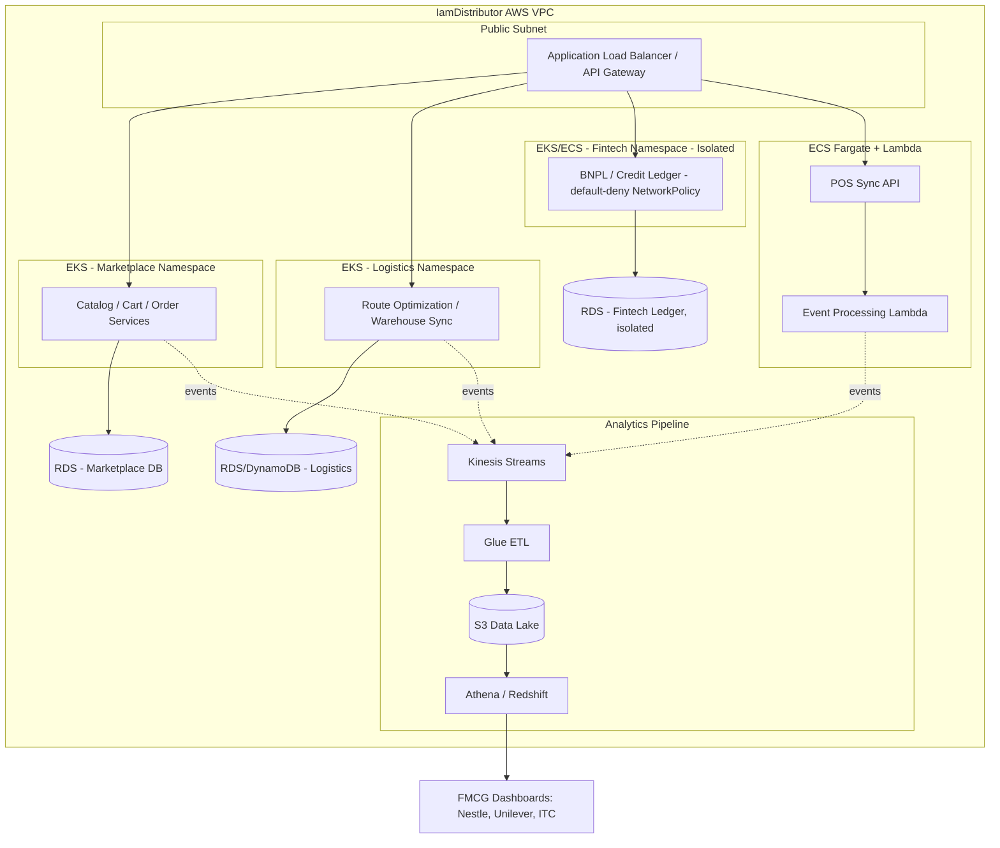

**Teaching note:** walk this diagram left to right, then top to bottom, asking students to justify each subgraph's platform choice using the comparison matrix in section 4 before revealing the reasoning in section 5.

---

## Self-Check: Note 1

1. Why can't IamDistributor use a single AWS compute platform for its entire business?
2. Why is Lambda a poor primary choice for the fintech ledger, even though it scales instantly and has zero idle cost?
3. What specific EKS feature makes it well suited to the Logistics pillar's mix of CPU-heavy and I/O-heavy jobs?
4. Why should analytics workloads (Glue/Kinesis/S3/Redshift) be architecturally decoupled from the marketplace's live production database?
5. What's the practical operational tradeoff between ECS Fargate and EKS, and when would you pick the "simpler" option even though EKS is more powerful?
6. Why does the fintech pillar benefit from a dedicated node group or VPC subnet rather than sharing infrastructure with the marketplace app?
7. Name one reason ECS/EKS is generally preferred over Lambda for services requiring strong auditability of a transaction's full lifecycle.

---
---

# Note 2: AWS Release/Rollout Strategies for IamDistributor

## 1. Framing: Platform vs Release Strategy

Note 1 answered **"where does the workload run."** This note answers a separate question: **"how does new code safely reach production once it's running there."** These are independent decisions, the same EKS cluster can deploy new versions via rolling update, blue-green, or canary, and the right choice depends on the *blast radius* and *rollback cost* of getting it wrong, not on the underlying compute platform.

**Teaching point to emphasize:** a badly chosen release strategy can undo all the benefits of a well-chosen platform. An EKS cluster with perfect autoscaling still causes a full outage if a bad deploy rolls out to 100% of pods simultaneously with no automated rollback trigger.

---

## 2. Deployment Strategy Options

### 2.1 Rolling Update

Old instances/pods/tasks are replaced gradually with new ones, a few at a time, until the whole fleet is on the new version.

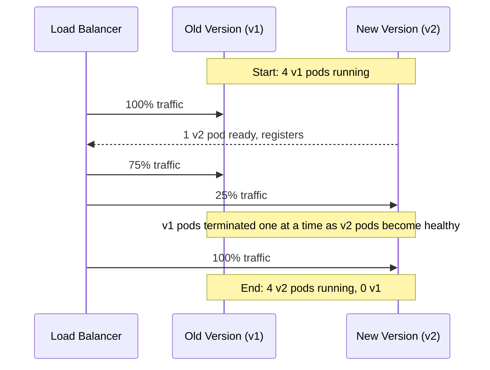

- **Rollback:** Re-run the rollout with the previous image/task definition (`kubectl rollout undo`, or revert ECS task definition revision). Not instant, takes as long as rolling forward did.
- **Blast radius:** Grows progressively as the rollout proceeds, if a problem is caught early, only a fraction of traffic was affected.
- **Best for:** Stateless, well-tested internal services where a few minutes of gradual exposure and a few-minutes rollback are acceptable.

### 2.2 Blue-Green Deployment

Two full, independent environments (Blue = current, Green = new) run simultaneously. Traffic is switched atomically from Blue to Green once Green is verified healthy.

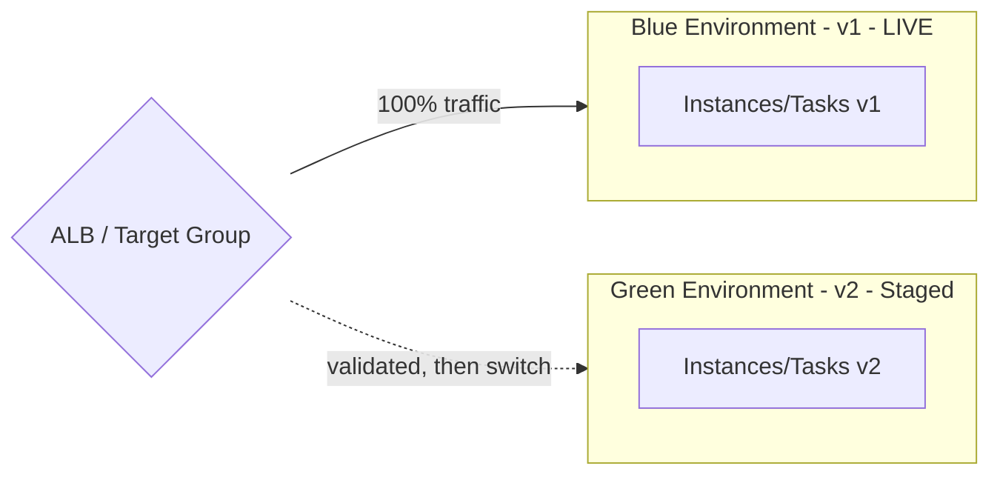

- **Rollback:** Instant, switch the ALB target group (or CodeDeploy shifts) back to Blue. No redeploy needed, the old environment is still running and untouched.
- **Blast radius:** Either 0% or 100%, there is no partial exposure, which is exactly why it's favored where partial exposure itself is unacceptable (e.g., a financial ledger should never have two versions writing simultaneously to shared state).
- **Cost overhead:** You run double the infrastructure during the transition window.
- **Best for:** High-stakes, compliance-sensitive services, and anywhere instant, guaranteed-clean rollback matters more than infrastructure cost.

### 2.3 Canary Deployment

A small percentage of real traffic is routed to the new version first; the percentage is increased gradually as confidence grows, based on live metrics.

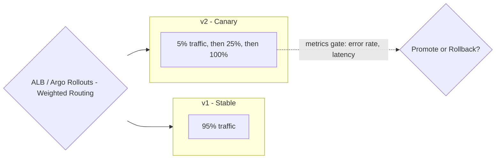

- **Rollback:** Fast, route the canary's traffic weight back to 0%. Only the small canary slice of users was ever affected.
- **Blast radius:** Small and controlled by design, this is its main advantage over both rolling update and blue-green.
- **Complexity:** Highest of the three, requires weighted routing infrastructure (Argo Rollouts on EKS, or CodeDeploy linear/canary configs on ECS/Lambda) and automated metric-based gating to be effective.
- **Best for:** Large customer-facing user bases where you want real production signal before full exposure, without ever risking more than a small slice of users.

### 2.4 Feature Flags / Progressive Rollout

Decouples **deployment** (code reaching production) from **release** (a feature becoming visible/active to users). The code ships to everyone; a runtime flag controls who sees the new behavior.

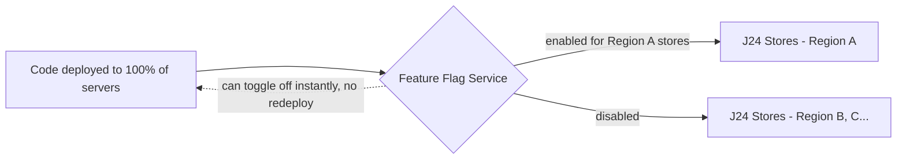

- **Rollback:** Instant and requires no redeployment at all, just flip the flag off.
- **Blast radius:** Fully controllable, down to individual users, stores, or regions.
- **Best for:** Client-facing rollouts where you cannot force simultaneous adoption, exactly the J24 POS situation, since store devices update on their own schedule and connectivity.

---

## 3. Risk Profile Comparison

| Strategy | Rollback Speed | Blast Radius | Infra Cost Overhead | Complexity | Good Fit for Stateful Services? |
|---|---|---|---|---|---|
| Rolling Update | Minutes | Grows progressively | None | Low | Caution needed (in-flight requests during transition) |
| Blue-Green | Instant | All-or-nothing | High (2x during switch) | Medium | Yes, especially where atomicity matters |
| Canary | Fast | Small, controlled | Low-medium | High | Caution (partial version coexistence) |
| Feature Flags | Instant | Fully controllable | Low | Medium (flag system to maintain) | Yes, decoupled from infra entirely |

---

## 4. Mapped Recommendations per IamDistributor Pillar

### Fintech / Credit Engine (BNPL, Solv) → **Blue-Green** (primary), with canary as a secondary option for lower-risk changes
A ledger-style system cannot tolerate two versions writing inconsistent logic to shared financial state simultaneously. Blue-green's all-or-nothing switch gives a clean audit trail ("at timestamp X, traffic cut from v1 to v2") and instant, guaranteed rollback, both of which matter directly for compliance reviews. The cost overhead of running two environments briefly is a rounding error against the cost of a financial data inconsistency.

### B2B Marketplace App → **Canary**
With 500,000+ retailers depending on the ordering flow, especially during high-traffic events, gradual exposure with live metric gating (error rate, latency, order-failure rate) catches problems while only a small percentage of retailers are affected. This directly reuses the Argo Rollouts pattern taught in the EKS platform module.

### Logistics & Fulfillment (internal tools) → **Rolling Update**
Internal warehouse and route-optimization tooling has a smaller, more tolerant user base (IamDistributor's own ops staff, not retailers), and issues are typically caught quickly through internal reporting. The lower complexity and cost of rolling updates is the right tradeoff here, paired with automated health-check-based rollback so a bad rollout self-heals rather than needing manual intervention.

### J24 POS / Retail SaaS → **Feature Flags + staged/regional rollout**
Store-level POS devices cannot be forced to update simultaneously, some have intermittent connectivity, some are mid-training-cycle with store owners. Shipping code to all devices but gating new behavior behind a flag, rolled out region by region, lets IamDistributor control exposure independent of each device's actual update timing, and instantly disable a problematic feature without needing every store to redeploy.

### FMCG Data & Analytics Pipeline → **Rolling Update** (for pipeline code), **versioned schemas** (for data)
Since this pillar is batch/near-real-time rather than live-traffic-serving, the release-strategy risk is lower; the bigger risk is a schema change breaking downstream dashboards. Rolling update the pipeline code, but treat data schema versioning as the primary safety mechanism (old and new schema versions coexist in the data lake until all downstream consumers migrate).

---

## 5. Rollback Mechanics, Side by Side

| Strategy | What Actually Happens on Rollback |
|---|---|
| Rolling Update | Re-run the rollout pointing at the previous image/task-definition revision; old pods/tasks are gradually reintroduced the same way the bad version was rolled out. |
| Blue-Green | ALB/CodeDeploy target group pointer flips back to the Blue environment, which was never torn down; effectively instantaneous. |
| Canary | Traffic weight for the canary version is set back to 0%; stable version continues serving 100% as if the canary never happened. |
| Feature Flags | Flag is toggled off at the flag service level; no redeployment occurs, affected users/stores immediately stop seeing the new behavior. |

---

## 6. Decision Tree for Choosing a Release Strategy

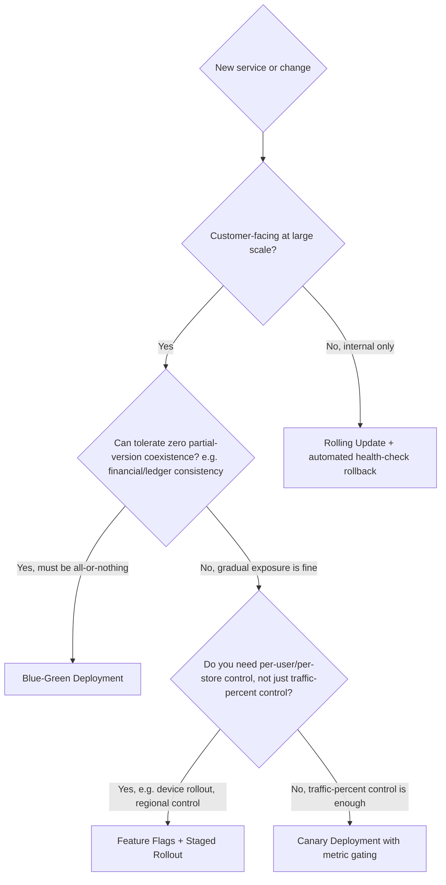

**Facilitation tip:** run this as a live exercise. Give students a new hypothetical IamDistributor feature (e.g., "a new dynamic pricing engine for the marketplace app") and have them walk the tree out loud before revealing where it lands.

---

## Self-Check: Note 2

1. Why is blast radius, not just rollback speed, an important axis when comparing rolling update, blue-green, and canary?
2. Why is blue-green specifically favored for the fintech ledger over canary, even though canary has a smaller blast radius?
3. What does "decoupling deployment from release" mean, and why does it matter for the J24 POS rollout specifically?
4. In a canary deployment, what should automatically trigger a rollback, and why shouldn't that decision be made by a human watching a dashboard alone?
5. Why does blue-green cost more to run than rolling update, and why might that extra cost be justified for some services but not others?
6. For the logistics/fulfillment internal tools, why is rolling update an acceptable choice even though it has the slowest rollback of the three infrastructure-level strategies?
7. If a new feature ships via feature flag but later needs to be permanently removed from the codebase, what release-strategy consideration does that introduce that a simple "flag off" doesn't fully solve?
