# Scaling in k8s - EcoRetail usecase

**Program:** DevOps  
**Work Type:** Post-read  
**Created by:** vilas  
**Date:** 2026-08-20

---

# EcoRetail: AWS Production Deployment Notes

## Table of Contents
1. Note 1: AWS Compute/Platform Deployment Options
2. Note 2: AWS Release/Rollout Strategies

---
---

# Note 1: AWS Compute/Platform Deployment Options for EcoRetail

## 1. What "Production-Quality Deployment" Actually Means

| Dimension | Question it answers |
|---|---|
| **Availability** | Does the platform survive an AZ failure, instance crash, or traffic spike without user-visible downtime? |
| **Scalability** | Can capacity grow/shrink automatically and match the actual shape of demand? |
| **Security & Compliance** | Can the workload be isolated (network, IAM, data) to the degree its risk profile demands? |
| **Rollback Safety** | If a bad deploy ships, how fast and how cleanly can you undo it? |
| **Cost Efficiency** | Are you paying for idle capacity, or paying proportional to actual usage? |
| **Operability** | How much day-2 operational burden does the team absorb? |
| **Reliability / DR** | What happens if an entire region or major dependency fails? |
| **Data Residency & Compliance** | Where must data legally reside, and what regulatory frameworks apply? |

**Teaching point:** EcoRetail is five distinct businesses under one brand. Each pillar answers these eight questions differently, so each deserves its own platform decision.

---

## 2. EcoRetail's Workload Map

| Pillar | Traffic Pattern | State | Criticality / Compliance | Notes |
|---|---|---|---|---|
| **B2B Marketplace App** | Spiky, high-volume, order-cutoff peaks | Mostly stateless | High (revenue) | 500,000+ retailers |
| **Logistics & Fulfillment** | Steady + scheduled bursts, job-heavy | Mixed | High (delivery SLAs) | Queue-driven |
| **Fintech / Credit Engine** (BNPL, Solv) | Lower volume, steady, transactional | Strongly consistent ledger | Very high, RBI-regulated | Requires audit trail, data isolation |
| **J24 POS / Retail SaaS** | Distributed, intermittent connectivity | Local-first, periodic sync | Medium-high | Thousands of loosely-connected endpoints |
| **FMCG Data & Analytics** | Batch / near-real-time | Stateless over stored data | Medium | Cost-sensitive, not latency-critical |

---

## 3. AWS Deployment Platform Options

### 3.1 EC2 + Auto Scaling Group

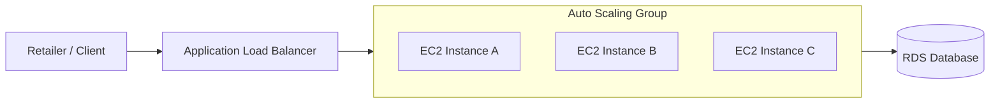

Full OS control, highest ops burden, slowest scaling (minutes). Fit for legacy or highly specialized workloads only.

### 3.2 AWS Elastic Beanstalk

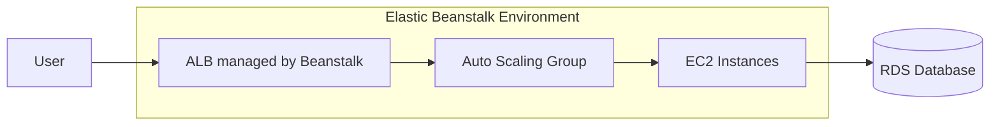

Fast to stand up, limited flexibility, becomes a dead end at EcoRetail's scale. Prototype-grade only.

### 3.3 ECS: Fargate and EC2 Launch Types

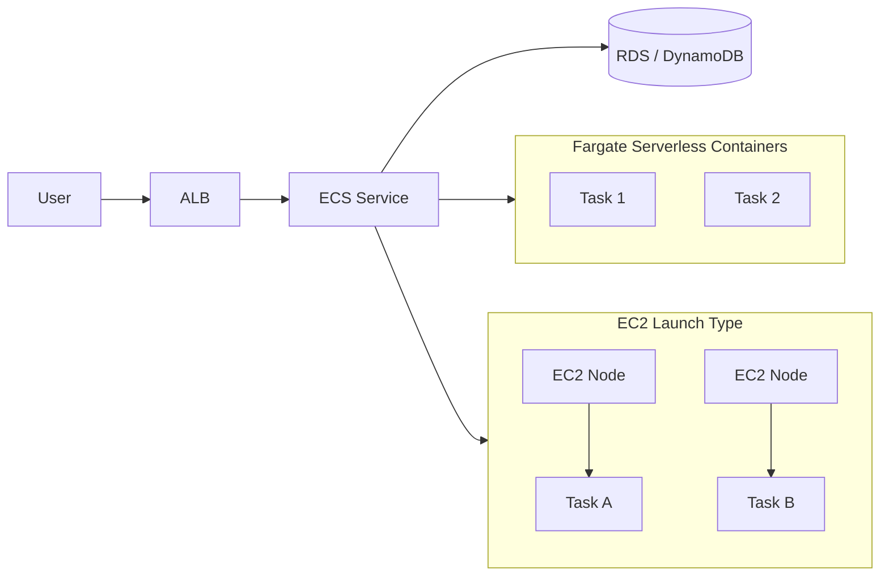

Simpler than Kubernetes, native AWS integration, less flexible/portable. Strong fit where Kubernetes-specific features aren't needed.

### 3.4 EKS (Elastic Kubernetes Service)

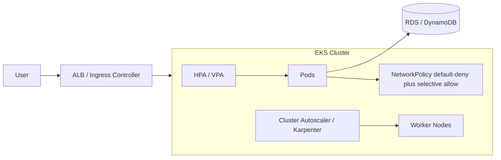

Full portability, richest ecosystem, fine-grained scaling. Highest learning curve and operational surface area.

### 3.5 Lambda + API Gateway

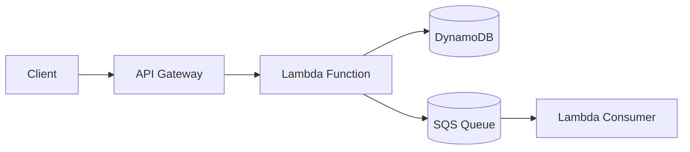

Zero idle cost, instant scale, cold starts, 15-minute execution cap. Best for event-driven, bursty workloads.

### 3.6 Managed Data/Batch Services

Purpose-built for data pipelines, decoupled from live transactional systems.

---

## 4. Comparison Matrix

| Platform | Ops Overhead | Scaling Granularity | Cold Start | Cost Model | Compliance/Isolation Fit | Team Skill Needed |
|---|---|---|---|---|---|---|
| EC2 + ASG | High | Coarse | None | Provisioned capacity | Good | Linux/VM ops |
| Elastic Beanstalk | Medium | Coarse | None | Provisioned capacity | Moderate | Minimal |
| ECS Fargate | Low | Fine | Low-moderate | Per task-second | Good | Container basics |
| ECS EC2 | Medium | Fine | None | Provisioned hosts | Good | Container + ops |
| EKS | High | Very fine | Low | Nodes + control plane fee | Excellent | Kubernetes expertise |
| Lambda | Very low | Instant | Present | Per invocation | Good | Event-driven design |
| Glue/EMR/Step Functions | Low-medium | Job-level | N/A | Per job/DPU-hour | Good | Data engineering |

---

## 5. Mapped Recommendations per Pillar

**Marketplace App -> EKS** (or ECS Fargate as lighter alternative): spiky, customer-facing traffic across 500,000+ retailers needs fine-grained autoscaling and microservice tooling.

**Logistics & Fulfillment -> EKS + SQS/Step Functions**: mixed CPU-heavy and I/O-heavy jobs suit VPA/HPA-driven per-workload shaping.

**Fintech/Credit Engine -> EKS (dedicated namespace/node group) or ECS Fargate, isolated**: never a shared serverless pool. Auditability and identity-stable, long-running containers matter more here than raw scaling elasticity.

**J24 POS Backend -> ECS Fargate (sync/API) + Lambda (event glue)**: intermittent, bursty, per-store events suit Lambda; the stateful sync API suits Fargate.

**FMCG Data & Analytics -> Glue + Kinesis + S3 + Athena/Redshift**: decoupled from production databases entirely.

---

## 6. Overall Reference Architecture

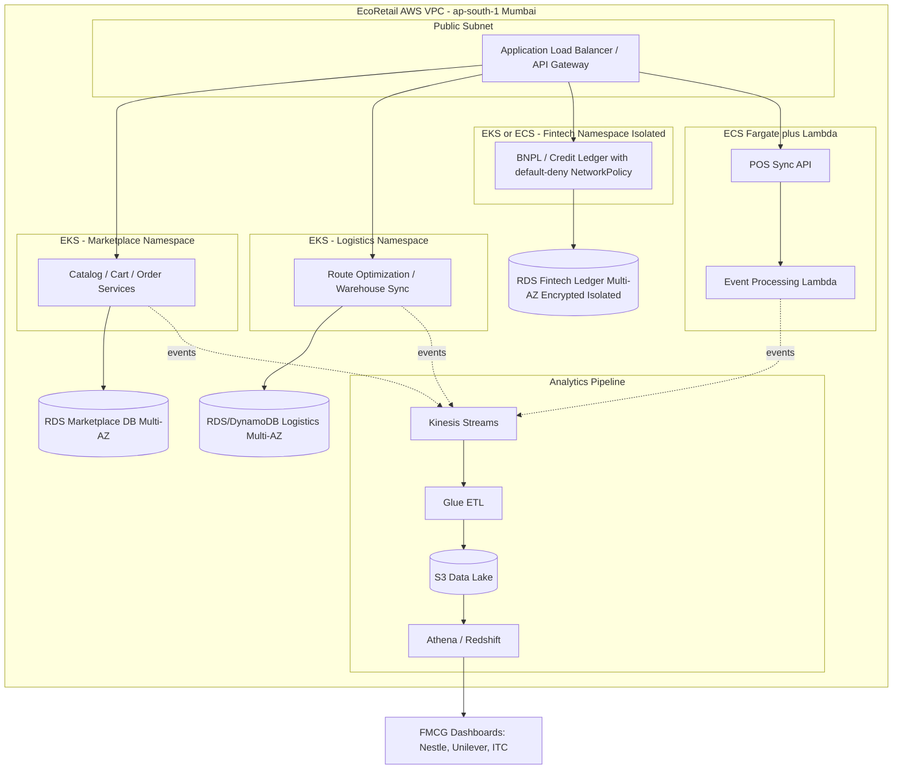

---

## 7. Non-Functional Requirements Deep-Dive (Security, Compliance, Reliability, Performance)

### 7.1 Security

| Layer | Control | Applies Most Critically To |
|---|---|---|
| **Network** | VPC segmentation, private subnets for compute/data, security groups as default-deny, NACLs for defense-in-depth | Fintech, Marketplace DB |
| **Kubernetes-native** | NetworkPolicy default-deny plus selective allow, namespace isolation per pillar | Fintech namespace especially |
| **Identity** | IAM least privilege, IRSA so pods assume scoped roles rather than node-wide roles, no long-lived static credentials | All pillars, non-negotiable for Fintech |
| **Secrets** | AWS Secrets Manager or Parameter Store (SecureString), never in Terraform state or CI variables in plaintext | Fintech API keys, DB credentials |
| **Encryption in transit** | TLS everywhere (ALB listeners, service mesh mTLS for pod-to-pod on EKS) | Fintech, Marketplace payment/order flows |
| **Encryption at rest** | RDS/DynamoDB/S3 encryption via KMS, customer-managed keys for Fintech data specifically | Fintech ledger, retailer PII |
| **Audit logging** | CloudTrail for all API-level actions, especially IAM and KMS key usage, retained per regulatory requirement | Fintech (mandatory for RBI audits) |

**Teaching emphasis:** ask which of these controls, if skipped, would still let the system function correctly but fail an audit or enable a silent breach. Answer: nearly all of them, this is why security gaps are dangerous, they do not show up as bugs.

### 7.2 Compliance and Data Residency (India-Specific)

- **RBI Digital Lending Guidelines**: EcoRetail's BNPL/working-capital credit (via Solv) is a regulated lending activity. This requires data localization within India, a clear audit trail for every lending decision, and separation of the lending ledger from other business data. This is exactly why the Fintech pillar gets a dedicated, isolated environment (see Section 5).
- **Data residency**: use **ap-south-1 (Mumbai)** as the primary region for any pillar handling retailer PII or financial data.
- **PCI-DSS awareness** (if card payments are processed directly rather than via a gateway partner): tokenize card data, never store raw card numbers, isolate payment-handling scope.
- **Data partner sharing (FMCG analytics)**: Nestle/Unilever/ITC receive aggregated/anonymized demand data, not retailer-identifiable records. Enforce this in the Glue/ETL transformation layer, not by trusting downstream consumers.

### 7.3 Reliability, Availability, and Disaster Recovery

| Pillar | Target Availability | Multi-AZ? | Backup Strategy | DR Approach |
|---|---|---|---|---|
| Marketplace App | 99.9%+ | Yes | Automated RDS snapshots, point-in-time recovery | Warm standby in a second AZ |
| Logistics | 99.9% | Yes | Snapshot + queue replay (SQS/Kinesis retention) | Tolerates brief degradation |
| Fintech/Credit | 99.95%+ | Yes, mandatory | Automated backups + immutable audit log retention (7+ years typical) | Pilot-light or warm-standby, explicit RTO/RPO with compliance team |
| J24 POS | 99.5% | Yes for backend | Standard backups | Local-first design absorbs short backend outages |
| Analytics | 99% (best-effort) | Not critical | S3 versioning, Glue job idempotency | Re-run pipeline from source data |

**Key terms:**
- **RTO (Recovery Time Objective):** how long the system can be down before it is a business-critical incident.
- **RPO (Recovery Point Objective):** how much data loss, measured in time, is acceptable during a failure.
- The Fintech pillar should have the strictest RTO/RPO of all pillars, since a ledger with lost or duplicated transactions is a regulatory and trust problem, not just a technical one.

### 7.4 Observability as an NFR

- Define SLOs per pillar (example: Marketplace API p99 latency under 300ms, Fintech transaction confirmation under 2s).
- Alert on symptom-based SLO breaches (error rate, latency, saturation), not just raw CPU.
- Fintech-specific: every transaction must be traceable end-to-end (distributed tracing) for audit and dispute resolution.

### 7.5 Performance / Latency Budgets

| Pillar | Latency Sensitivity | Why |
|---|---|---|
| Marketplace App | High (sub-second) | Retailers abandon slow ordering flows |
| Logistics | Medium | Route computation and sync are not real-time user-facing |
| Fintech | Medium-high | Approval speed affects trust, but correctness outweighs speed |
| J24 POS | Low-medium | Local-first design absorbs backend latency |
| Analytics | Low | Near-real-time or batch is acceptable |

---

## Self-Check: Note 1

1. Why can't EcoRetail use a single AWS compute platform for its entire business?
2. Why is Lambda a poor primary choice for the fintech ledger, even though it scales instantly?
3. Which AWS region should host EcoRetail's fintech and retailer PII data, and why?
4. What's the difference between RTO and RPO, and why should Fintech have the strictest targets of all five pillars?
5. Why is IRSA preferred over node-wide IAM roles in EKS?
6. Why must FMCG partner analytics be aggregated/anonymized at the ETL layer rather than relying on partner-side policy?
7. Name two controls that, if skipped, would not break functionality but would fail a compliance audit.

---
---

# Note 2: AWS Release/Rollout Strategies for EcoRetail

## 1. Framing: Platform vs Release Strategy

Note 1 answered where the workload runs. This note answers how new code safely reaches production. A badly chosen release strategy can undo the benefits of a well-chosen platform: a perfectly autoscaled EKS cluster still causes a full outage if a bad deploy ships to 100% of pods at once with no automated rollback trigger.

---

## 2. Deployment Strategy Options

### 2.1 Rolling Update

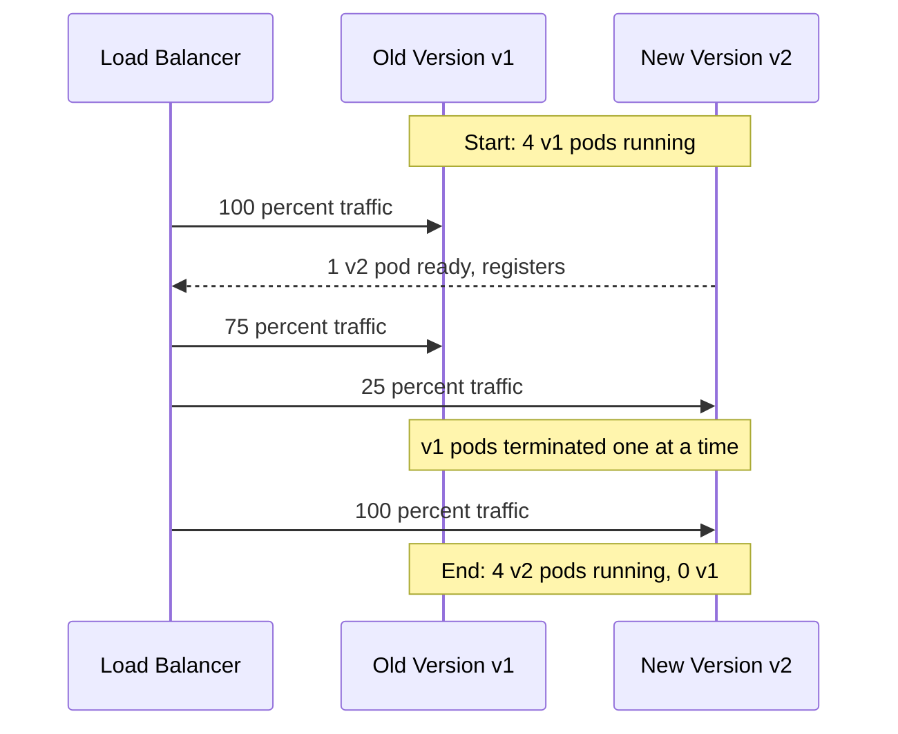

Rollback: re-run rollout pointing at previous version, takes minutes. Blast radius grows progressively.

### 2.2 Blue-Green Deployment

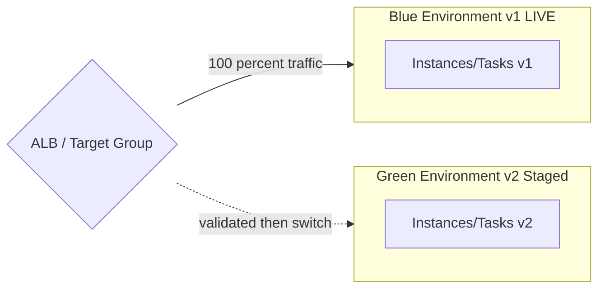

Rollback: instant, flip target group back. Blast radius: all-or-nothing. Costs double during transition.

### 2.3 Canary Deployment

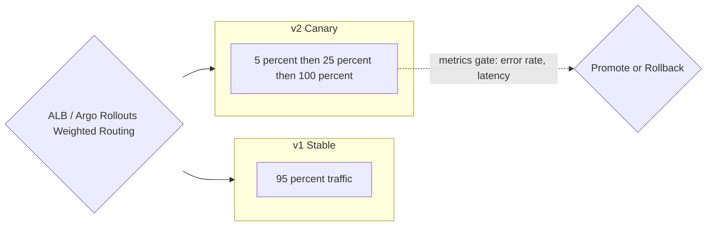

Rollback: fast, route canary weight back to 0 percent. Blast radius small and controlled. Highest complexity.

### 2.4 Feature Flags / Progressive Rollout

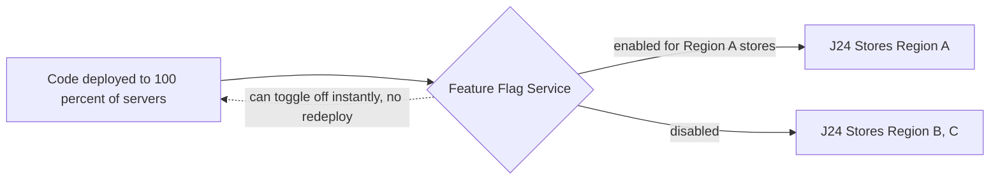

Rollback: instant, flip flag off, no redeployment. Blast radius fully controllable per user/store/region.

---

## 3. Risk Profile Comparison

| Strategy | Rollback Speed | Blast Radius | Infra Cost Overhead | Complexity | Fit for Stateful Services |
|---|---|---|---|---|---|
| Rolling Update | Minutes | Grows progressively | None | Low | Caution needed |
| Blue-Green | Instant | All-or-nothing | High (2x briefly) | Medium | Yes, atomicity-friendly |
| Canary | Fast | Small, controlled | Low-medium | High | Caution |
| Feature Flags | Instant | Fully controllable | Low | Medium | Yes, decoupled from infra |

---

## 4. Mapped Recommendations per Pillar

**Fintech/Credit Engine -> Blue-Green** (primary): all-or-nothing switch avoids two versions writing inconsistent logic to shared financial state, and gives a clean, auditable cutover timestamp for compliance review.

**Marketplace App -> Canary**: 500,000+ retailers depend on ordering; gradual exposure with live metric gating limits impact.

**Logistics (internal tools) -> Rolling Update**: smaller, more tolerant internal user base; lower cost/complexity is the right tradeoff.

**J24 POS -> Feature Flags plus staged regional rollout**: store devices cannot be forced to update simultaneously; flags decouple deployment from release.

**FMCG Analytics -> Rolling Update plus versioned data schemas**: pipeline risk is lower; schema versioning is the primary safety mechanism.

---

## 5. Rollback Mechanics Side by Side

| Strategy | What Happens on Rollback |
|---|---|
| Rolling Update | Re-run rollout with previous image/task-definition revision |
| Blue-Green | Target group pointer flips back to Blue, instantaneous |
| Canary | Canary traffic weight set back to 0 percent |
| Feature Flags | Flag toggled off at the flag service, no redeploy |

---

## 6. Decision Tree

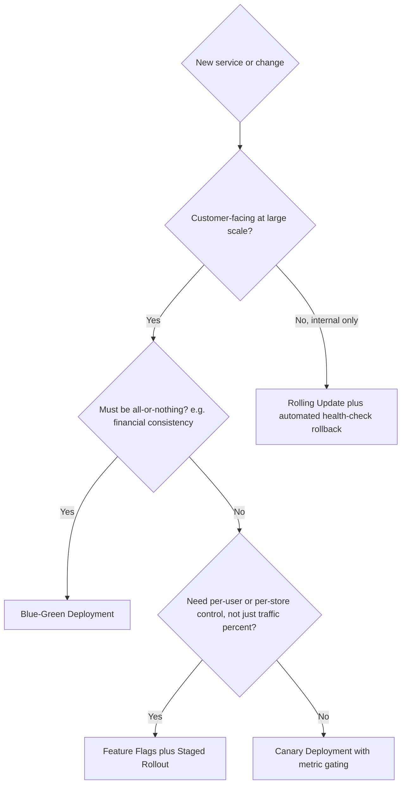

---

## 7. Non-Functional Requirements Tie-In for Release Strategy

| NFR | How Release Strategy Choice Serves It |
|---|---|
| **Security/Compliance** | Blue-green's atomic cutover creates a clean, timestamped audit boundary, exactly what RBI-style compliance review expects for the Fintech pillar |
| **Reliability** | Canary's metric-gated promotion prevents a bad release from degrading availability for the full user base |
| **Performance** | Canary surfaces real production latency regressions on a small slice before they affect all 500,000+ retailers |
| **Data Integrity** | Blue-green avoids two schema/logic versions writing to the same ledger simultaneously, directly protecting RPO for Fintech |
| **Operability** | Feature flags reduce coordination burden across thousands of independently-updating J24 store devices |

**Discussion prompt:** If canary deployments have a smaller blast radius than blue-green, why is blue-green still the right choice for the fintech ledger? Guide students to the answer: blast radius alone does not capture data consistency risk. A canary at 5 percent still means two versions are writing to the same shared financial state concurrently, which blue-green avoids entirely by design.

---

## Self-Check: Note 2

1. Why is blast radius, not just rollback speed, an important axis for comparing strategies?
2. Why is blue-green favored for the fintech ledger over canary, despite canary's smaller blast radius?
3. What does decoupling deployment from release mean, and why does it matter for J24 POS?
4. What should automatically trigger a canary rollback, and why shouldn't a human alone make that call?
5. Why does blue-green cost more than rolling update, and when is that cost justified?
6. Why is rolling update acceptable for internal logistics tools despite its slower rollback?
7. How does blue-green deployment directly support the Fintech pillar's RPO target from Note 1, Section 7.3?
